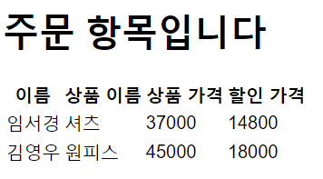
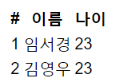

# Spring_practice_1
## 강의 다 ~~듣다말고~~ 듣고 해보는 연습
(인프런 김영한 선생님의 강의 참조!)
-----

<em>추상과 구현의 정신으로!<em>

<ul>
- order
(주문자, 상품이름, 상품가격, 개수, 할인가격)형태로 받는 주문!
할인 가격은 개수와 할인 가격이 결정돼야 정해지므로 나중에
구현체를 이용해 선언해줌
 
- member
회원 가입 및 리포지토리에 회원을 저장해주는 클래스
 
- discount
일정 가격이 초과되면 20% 할인을 제공해주는 클래스
</ul>

<ul>
-controller
 
* HomeController
처음 실행 시켰을 때 "~/"으로 딱! 설정된 페이지
 
회원 가입/조회, 주문 작성/조회 페이지로 연결시켜줌
 
* MemberController
회원 가입, 회원 조회, 주문 작성, 주문 조회
(아직은) 네개의 페이지를 관리하는 컨트롤러
 
여기서 @GetMapping, @PostMapping이 사용됨!
 
PostMapping은 html의 body에 데이터를 적어 보내는 방식
 (여기서는 form 형태에 넣어 멤버, 주문 데이터를 보냄)
  
GetMapping은 get 방식으로 데이터를 url에 적어 보내는 방식
 
return을 html 페이지로 해주어 form 데이터 전송받고,
페이지에 뿌릴 내용을 전달해주도록 함...!?
 
* MemberForm
html에서 회원 가입이나 주문 작성시 폼 테그에서 전송이 이뤄지면,
이를 form 클래스를 이용해 받아와 출력까지 잘 연결시켜주는 컨트롤러
 
-html
 
회원 폼이나 주문 폼을 작성할때 필요한 페이지,
회원이나 주문서를 조회할 때 필요한 페이지를 작성해따
</ul>

 
<ul>

 

</ul>

 
 
<ol>
* 빈 등록
 
* 추상과 구현의 완벽한 구별을 위한 클래스(appConfig)생성
 
차차 적어볼게용..
</ol>

